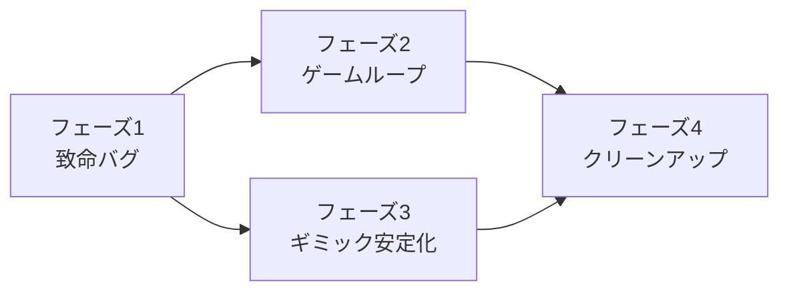

# EchoExit 問題点整理と実装計画書

作成日: 2026-07-17
更新: 2026-07-17 フェーズ1(致命バグ修正)実装済み ✅
対象ブランチ: `codex/fix-game-loop-round-selection`
調査範囲: `Assets/Scripts/` 配下の全スクリプト、ビルド設定、Resources、タグ設定

---

## 1. 現状の全体像

- ゲームループ: `tittle` → `MainScene`(異変あり/なしを判定して前進/後退) → 連続正解 `goalThreshold`(8) 到達で `endTitle`
- ラウンド遷移は **MainScene の自己リロード** + `static` フィールド(`pendingSceneId` / `pendingSpawnAnomaly` / `correctCount`)による持ち回り
- ステージデータは EditMode で配置 → `persistentDataPath/Saves/*.json` に保存 → `GameManager` が読込
- 異変判定は `AbnormalityPresenceDetector` がタグ `Anomary` を実スキャンして確定

---

## 2. 発見した問題点

### A. 重大(ゲーム進行・データに影響)

| # | 問題 | 場所 |
|---|------|------|
| A-1 | `correctCount` が `static`。タイトルに戻っても値が残り、次のプレイが途中カウントから始まる。エディタで Domain Reload を無効にしている場合はプレイ間でも残留する | `GameManager.cs:68` |
| A-2 | シーン遷移フォールバックが機能しない。`SceneManager.LoadScene` は存在しないシーン名でも**例外を投げない**(エラーログのみ)ため、`SafeLoadSceneByName` の try/catch は決して発動せず、`nextSceneName` の設定ミス時にゲームがその場で停止する | `GameManager.cs:486-508` |
| A-3 | 初回起動時にプレイ用データが存在しない。`Resources/anomalies.json` は旧形式(配列形式)で読込対象外。セーブディレクトリに JSON が無いと空ワールドになる。初回用デフォルトデータの展開処理が無い | `GameManager.cs:207-215`, `Assets/Resources/anomalies.json` |
| A-4 | ファイル名規約の不一致。`TMP_DropdownSaver` は `anomaly_{suffix}.json` を生成するが、各所のフォールバックは `anomalies.json`。またドロップダウンの選択肢が変わって保存済み index が範囲外になると `sharedString.value` が更新されず前回値のまま使われる | `DropdownSaver.cs:26,37`, `SavePathProvider.cs:18` |
| A-5 | EditMode の保存が常に「新規追加」。同じ `currentSceneId` で保存すると自動で別 ID に振り直して追記するため、**既存ステージの上書き編集が不可能**でデータが肥大化し続ける。既存データの読み込み表示(再編集)機能も無い | `EditModeManager.cs:484-511` |
| A-6 | `GameManager` の `sceneIdSource` 既定値が `BuildIndex`。MainScene の buildIndex(3)が sceneId として使われるが、EditMode の保存 ID は 1 始まりの連番なので**既定設定のままだと JSON ブロックに一致せず何も出現しない**。インスペクタで `RandomFromJson` に設定しないと成立しない | `GameManager.cs:48`, `EditModeManager.cs:48` |
| A-7 | 正解/不正解のフィードバックが一切ない(音・演出・表示)。プレイヤーは正解数カウンタの増減でしか結果を知れず、不正解時も無言でリセットされる | `GameManager.cs:448-461` |
| A-8 | 抽選と実態の不整合。`PickSceneIdByAnomaly` が候補不足で逆側プールへフォールバックすると、`pendingSpawnAnomaly` と実際のシーン内容が食い違う(判定自体は `ScanNow` で救済されるが、異変出現率が設定値からずれる)。また worldRoot 外に手動配置した異変オブジェクトはスキャン対象外 | `GameManager.cs:306-313`, `AbnormalityPresenceDetector.cs:116-137` |

### B. 中程度のバグ・不具合

| # | 問題 | 場所 |
|---|------|------|
| B-1 | `TeddyVanishRespawn`: `AudioSource` を `GetComponent` するだけで `RequireComponent` も null チェックも無く、`vanishSound` 設定時にコンポーネント未添付だと NRE | `TeddyVanish.cs:20,57` |
| B-2 | `ShrinkByDistance`: 縮小/拡大量が `Time.deltaTime` 非依存の毎フレーム加算で**フレームレート依存**。また縮小途中で判定距離帯(vanish〜reappear の間)に入ると中途半端なサイズで停止する | `ShrinkByDistance.cs:60-85` |
| B-3 | `SeenColorShift`: `requiredGazeTime` 到達時に `unseenColor` を再代入しているだけで実質無意味。注視時間の仕様が実装に反映されていない。`isCurrentlyVisible` の二重代入もあり意図が読み取れない | `SeenColorShift.cs:29-71` |
| B-4 | `PlayerMovement`: `Camera.main` を毎フレーム参照(GC/性能)かつ null チェック無し。メインカメラ不在で即 NRE | `PlayerController.cs:23` |
| B-5 | `CameraController`: `target` 未設定で NRE。壁とのコリジョン処理が無くカメラが壁を貫通する | `CameraController.cs:41` |
| B-6 | `ButtonHandler.CheckJsonFile` が「チェック」なのに**空ファイルを書き込む副作用**を持つ。ドロップダウンを切り替えるたびに空 JSON がセーブフォルダに量産される | `ButtonHandler.cs:81-84` |
| B-7 | EditMode のショートカット(Enter=保存+シーン遷移、L=編集終了、O=タイトルへ)が UI モード中や TMP 入力中でも常時発火する | `EditModeManager.cs:134-146` |
| B-8 | `EditModeManager.OnDestroy` で `quitButton` のリスナー解除漏れ | `EditModeManager.cs:163-168` |
| B-9 | `anomalySpawnChance` のコメントが「未使用」だが実際は抽選に使用されており誤解を招く | `GameManager.cs:40` |

### C. 構造・保守性

| # | 問題 | 場所 |
|---|------|------|
| C-1 | 日本語コメントの文字化け(Shift-JIS で保存されたファイルが多数)。`PlayerController.cs`, `CameraController.cs`, `EndButtonHandler.cs`, `Anomary/` 配下ほか | 複数ファイル |
| C-2 | 死にコード・重複: `SaveManager`(スロットセーブ、どこからも未使用)、`SceneData.cs` の `AllScenesData`(EditModeManager 内 DTO と重複定義)、`ObjectLoader`(ダミー JSON)、`NewMonoBehaviourScript`(空)、`oldUI/StartButtonHandler`、`GameManager.sceneBindings` と旧形式 DTO `AnomalyData`(未使用) | 複数ファイル |
| C-3 | シーン名 typo「`tittle`」(正: title)。さらに `tittle 1.unity` という重複らしきシーンが存在。old シーン 2 つがビルド設定に含まれたまま | `Assets/Scenes/`, `EditorBuildSettings.asset` |
| C-4 | 移動・カメラ系が複数系統混在(StarterAssets の ThirdPersonController と自作の PlayerMovement / CameraController / ThirdPersonMovement / TurnWithCamera)。どれが正か判別しにくい | `Assets/Scripts/`, `Assets/StarterAssets/` |
| C-5 | ラウンド遷移が毎回シーン全リロード + `static` 持ち回り。動作はするが、リロードを worldRoot の再構築だけに変えれば static が不要になりロードも高速化する(将来課題) | `GameManager.cs:480-483` |
| C-6 | `Assets/Resources/anomalies.json`, `db.json` は旧データで未使用のまま残存 | `Assets/Resources/` |

---

## 3. 実装計画

### フェーズ 1: 致命バグ修正(最優先・小規模) ✅ 実装済み(2026-07-17)

**目標: 設定どおりに遊べば必ずゲームが成立する状態にする**

> 実装メモ: A-1 は「pending が無い＝新規プレイ」と判定して `Start()` 冒頭でリセットする方式を採用
> (ラウンド持ち回り時は必ず pending が設定されるため、シーン名に依存せず判定できる)。
> A-3 のデフォルトデータは `Assets/Resources/DefaultAnomalies.json`(新形式・4シーン)。
> 旧 `Resources/anomalies.json` / `db.json` は削除済み(C-6 完了)。B-6・B-9 も同時に対応済み。

1. **A-1 correctCount の static 廃止**
   - `correctCount` をインスタンスフィールド化し、ラウンド間の持ち回りは `pendingSceneId` と同様の専用ラウンド状態(後述フェーズ3で class 化)で管理。当面は static のままでも `tittle` / `endTitle` ロード時に必ずリセットする経路を追加(`SceneManager.sceneLoaded` で MainScene 以外なら 0 に)
   - 受入条件: ゴール後・中断後にタイトルから再開してもカウントが 0/8 から始まる
2. **A-2 シーン遷移フォールバック修正**
   - `SafeLoadSceneByName` を `Application.CanStreamedLevelBeLoaded(sceneName)` による事前チェック方式へ変更。ロード不可なら `endTitle` → 現行シーンの順でフォールバック
   - 受入条件: `nextSceneName` に存在しない名前を設定してもゲームが停止しない
3. **A-6 sceneIdSource の既定値と安全化**
   - 既定値を `RandomFromJson` に変更。`BuildIndex` 選択時に該当 sceneId が JSON に無い場合は警告して `RandomFromJson` 相当へフォールバック
   - 受入条件: プレハブ初期状態の GameManager でもラウンドにオブジェクトが出現する
4. **A-3 初回データの展開**
   - 新形式のデフォルト JSON を `Resources`(または `StreamingAssets`)に用意し、セーブディレクトリに対象ファイルが無ければ初回コピーする処理を `SavePathProvider` に追加。旧形式 `anomalies.json` / `db.json` は削除(C-6 と同時対応)
   - 受入条件: クリーンインストール直後でも Play ボタンが有効になり、ラウンドが成立する
5. **A-4 ファイル名規約の統一**
   - デフォルトファイル名を 1 箇所(`SavePathProvider` の定数)に集約。`TMP_DropdownSaver` は保存 index が範囲外なら index 0 にフォールバックして必ず `sharedString.value` を設定する
   - 受入条件: ドロップダウン選択・エディット・プレイで常に同一ファイルが参照される

### フェーズ 2: ゲームループの成立性向上

**目標: 「編集→保存→プレイ」のサイクルを破綻なく回せるようにする**

1. **A-5 EditMode の上書き保存と再編集**
   - 保存時に同一 `sceneId` が存在する場合は「上書き / 新規 ID」を選べる UI(最低限は上書きを既定に)へ変更
   - 既存 `sceneId` のデータを読み込んでシーン上に復元する「編集再開」機能を追加(`SpawnItem` 相当の処理を共通化して流用)
   - 受入条件: 同じステージを繰り返し編集してもファイル内の scenes が増殖しない
2. **A-7 正解/不正解フィードバック**
   - `PlayerChose` の判定結果で SE + 画面演出(正解: 短いフラッシュ等 / 不正解: 失敗演出とカウンタリセットの明示)を挟んでからリロードする。演出中は `inputLocked` を維持
   - 受入条件: プレイヤーが遷移前に正誤を認知できる
3. **A-8 抽選の整合性**
   - `PickSceneIdByAnomaly` がフォールバックした場合は `pendingSpawnAnomaly` を実際に選ばれたプールに合わせて上書きする
   - 手動配置の異変対策として、`AbnormalityPresenceDetector` の `scanRoot` 未設定時はシーン全体スキャン(現状実装済)を使う運用をコメントで明記
   - 受入条件: 異変出現率がフォールバック時も破綻しない
4. **B-6 / B-7 UI・入力の副作用除去**
   - `CheckJsonFile` から空ファイル生成を削除(存在しなければ単に無効表示)
   - EditMode のショートカットを `isUIActive` 中は無効化
   - 受入条件: セーブフォルダに空ファイルが生成されない。UI 操作中に誤保存・誤遷移しない

### フェーズ 3: 異変ギミック・操作系の安定化

1. **B-1 TeddyVanishRespawn**: `[RequireComponent(typeof(AudioSource))]` 追加、または null ガード
2. **B-2 ShrinkByDistance**: 縮小/拡大速度を `Time.deltaTime` ベース(単位: スケール/秒)へ変更。中間距離帯では現在の目標(縮小 or 復帰)を継続するステート方式に修正
3. **B-3 SeenColorShift**: 仕様を確定(「一度見て、視線を外して delayBeforeRed 秒経つと赤くなる」)し、`requiredGazeTime` を「見たと判定するのに必要な注視時間」として機能させる。冗長な代入を削除
4. **B-4 / B-5 NRE 対策**: `Camera.main` は `Start` でキャッシュ + null ガード。`CameraController.target` 未設定時は警告して無効化。カメラの壁貫通は `SphereCast` によるカメラ距離補正を追加
5. **C-4 操作系の一本化**: 実際に使用している移動・カメラ系統を特定し(シーン内の参照を確認)、未使用側のスクリプトを `old/` へ隔離または削除

### フェーズ 4: クリーンアップ(機能変更なし)

1. **C-1 文字コード統一**: 文字化けしているファイルを UTF-8(BOM 付き)で保存し直し、コメントを復元・書き直し
2. **C-2 死にコード削除**: `NewMonoBehaviourScript`、`ObjectLoader`、`SceneData.cs` の重複 DTO、`GameManager` の `sceneBindings` / 旧形式 DTO、`oldUI/`。`SaveManager` はスロットセーブを実装予定なら残置理由をコメントで明記、予定が無ければ削除
3. **C-3 シーン整理**: `tittle 1.unity` の要否確認のうえ削除。old シーンをビルド設定から除外。シーン名 rename(`tittle`→`Title` 等)は参照文字列が多いため、`SceneNames` 定数クラスを導入して文字列一元化とセットで実施
4. **C-6 旧データ削除**: `Resources/anomalies.json`, `db.json`(フェーズ1-4 でデフォルトデータを新形式に置き換えた後)
5. **B-8 / B-9 その他小修正**: `quitButton` リスナー解除、誤コメント修正
6. **(任意)C-5 シーンリロード廃止**: ラウンド遷移を worldRoot 再構築のみに変更し、全 static 持ち回り(`pendingSceneId` / `pendingSpawnAnomaly`)を通常フィールドへ戻す。フェーズ1〜3 の安定後に着手

---

## 4. 優先度と依存関係

| フェーズ | 規模感 | リスク |
|---------|--------|--------|
| 1 | 小(各修正は数十行) | 低。既存挙動の互換に注意(A-6 の既定値変更はプレハブ設定済みプロジェクトには影響なし) |
| 2 | 中(EditMode UI 追加あり) | 中。保存フォーマットは変えないこと(既存セーブ互換維持) |
| 3 | 小〜中 | 低。ギミックの見た目調整はプレイテスト必須 |
| 4 | 中(ファイル削除・シーン整理) | 中。削除前にシーンからの参照有無を必ず確認(Missing Script 化防止) |

## 5. 検証方法(全フェーズ共通)

- クリーンな `persistentDataPath`(セーブフォルダ削除)からの初回起動 → 編集 → 保存 → プレイ → ゴール → タイトル復帰の一連を通しで確認
- 異変あり/なし両ラウンドで前進・後退の 4 パターンの正誤判定を確認
- `nextSceneName` 誤設定、JSON 破損、タグ未定義などの異常系でゲームが停止しないことを確認
