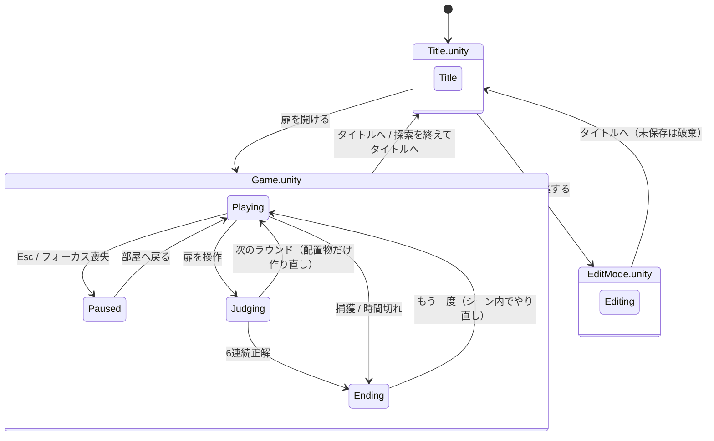

# 666号扉 再構築版 — 現状実装まとめ

2026-09-14 時点。対象はブランチ `feat/first-person-editor` の `Rebuild/666Door` です（§10）。

## 0. 先に結論

1. **シーンは「画面ごとの3シーン」＋「部屋の Field シーン」の4つ**です（§2）。画面を移るときはシーンを切り替え、部屋は各画面シーンが追加読込します。**部屋（建物・照明・扉・固定の家具）は `Field.unity` に実体として保存**されているので、再生しなくてもエディタで見て編集できます。
2. JSON の **`sceneId` は Unity のシーンではなく「部屋の配置パターン番号」**です。建物は全ステージで共通で、ステージごとに違うのは置かれる家具と異変だけです。
3. **編集画面は一人称です**。部屋を歩き回りながら配置物を置き、置いた異変はその場で動くので儀式を試せます（§7）。当初は見下ろし型の配置ツールとして作られていましたが、企画の意図に合わせて作り直しました。

---

## 1. フォルダ構成

```
Rebuild/666Door/                  独立した Unity プロジェクト（Unity 6000.3.10f1 / URP）
├─ Assets/
│  ├─ Game/Core/                  Unity に依存しないロジック（テスト対象）
│  │   StageData / StageRepository   ステージJSONの型、読込・マージ・保存
│  │   StageValidator                保存前の検証
│  │   RoundSelector / RunSession    部屋の抽選、ラン状態（連続正解・残り時間・終了種別）
│  │   AnomalyDefinition             異変定義（儀式・演出・手がかり・追跡設定）
│  │   RitualRuntime / ThreatRuntime 儀式の状態機械、追跡と捕獲の猶予
│  ├─ Game/Runtime/               MonoBehaviour 側
│  │   SceneController               画面シーン共通の土台（設定・入力・プレイヤー・UI・Field の読込・シーン移動）
│  │   TitleSceneController          Title.unity：背景の部屋とタイトルメニュー
│  │   GameSceneController           Game.unity：ラン、ラウンド進行、扉の判定、エンディング
│  │   EditModeSceneController       EditMode.unity：配置編集
│  │   FieldRoot                     Field.unity のルート。扉・配置物の親・ナビメッシュ・天井などへの参照
│  │   WorldBuilder                  Field の「Stage placements」の下にステージ配置物を生成
│  │   ObjectCatalog                 prefabId → 見た目（プリミティブの組み合わせ）と当たり判定
│  │   AnomalyActor / AnomalyEffects 異変1体分の儀式判定・認識演出・手がかり
│  │   FirstPersonRig / PlayerInputReader  一人称移動と入力（Input System）
│  │   GameUI                        全画面のUIをコードで生成（uGUI + TextMeshPro）
│  │   PlacementEditor               編集画面
│  │   SpatialAudio                  効果音をコードで生成して3D再生
│  ├─ Game/Editor/                 ProjectBootstrap（初期化メニュー）、FieldSceneBuilder（Field.unity をコードから生成）、
│  │                                 FieldSceneAutoOpen（画面シーンを開くと Field も自動で追加表示）
│  ├─ Field/                        Field.unity 用のマテリアルとテクスチャ
│  ├─ Resources/                    AnomalyDefinitions.json（異変定義）、DefaultAnomalies.json（初期ステージ）、
│  │                                 GameSettings.asset（調整値）、PlayerControls.inputactions、フォント、
│  │                                 Materials/Catalog（配置物のマテリアル）
│  ├─ Scenes/                       Title / Game / EditMode / Field（初回だけ ProjectBootstrap が生成）
│  └─ Tests/Editor/                 EditMode テスト
└─ Documentation/                  このファイル、フォントライセンス
```

旧プロジェクト（リポジトリ直下の `Assets/`）のコードやシーンは使っていません。持ち込んだのは `DefaultAnomalies.json`、`bears.fbx`、日本語フォントだけです。

---

## 2. シーン管理

### 2.1 旧実装との比較

| | 旧実装 | 再構築版（シーン分割前） | 再構築版（現在） |
|---|---|---|---|
| Unity シーン | `tittle` / `MainScene` / `EditMode` / `endTitle` / `SampleScene` の5つ | `666Door` の1つ | `Title` / `Game` / `EditMode` ＋ `Field` |
| 画面の切り替え | `SceneManager.LoadScene` | 同じシーン内で UI とワールドを作り直す | `SceneManager.LoadScene`（Single） |
| 部屋 | シーンに手で配置 | すべてコードで生成 | `Field.unity` に実体として保存し、各画面シーンが追加読込 |
| ラウンドの交代 | ― | 部屋ごと作り直す | `Field` の `Stage placements` の下だけ作り直す |
| ラン状態 | `static` 変数でシーンをまたぐ | `SessionCoordinator` が保持 | `GameSceneController` が保持。シーンをまたいで持ち回らない |

「ラウンドごとにシーンを再ロードしない」「ラン状態を `static` で持ち回らない」（再構築仕様書 §8）は守っています。シーンを移ると、設定・ステージ・入力はそのシーンで読み直します。

| シーン | 置いてあるもの | 再生時にコードで作るもの |
|---|---|---|
| `Title.unity` | `TitleSceneController` だけ | プレイヤー（カメラ）、UI、環境音。背景として「ステージ1・異変なし」の配置物 |
| `Game.unity` | `GameSceneController` だけ | プレイヤー、UI、環境音、各ラウンドの配置物と異変 |
| `EditMode.unity` | `EditModeSceneController` だけ | プレイヤー（見下ろしカメラ）、UI、編集中の配置物とガイド |
| `Field.unity` | 建物、照明8灯、前後の扉、固定の家具、掲示板など、`FieldRoot`、`NavMeshSurface` | なし（ナビメッシュのデータだけ、ラウンドごとに生成） |

### 2.2 画面遷移

画面の中の状態は各コントローラーの `Screen`（`GameScreen` 列挙型）で管理しています。設定画面は独立した画面ではなく、タイトルまたは一時停止の上に重ねるメニューです。



`Error` という状態もあります。保存ファイルを読めないとき、抽選できる部屋がないとき、Field シーンを読み込めないときに使います。

### 2.3 起動の流れ（画面シーン共通）

1. `Awake`：設定、異変定義、入力、プレイヤー、UI、ステージ（保存ファイル）、環境音を用意します（`SceneController`）。
2. `Start`：`Field` シーンが読み込まれていなければ追加読込し、`FieldRoot` を見つけて `WorldBuilder` を作ります。
3. `Enter`：シーンごとの処理に入ります。Title はタイトルメニュー、Game はランの開始、EditMode は編集画面を開きます。
4. 画面を移るときは `LoadScene`（Single）を呼びます。Field もいったん破棄され、次のシーンが読み直します。

### 2.4 エディタでの見え方と編集

- `Title` / `Game` / `EditMode` のどれかを開くと、`Field` も自動で追加表示されます（`FieldSceneAutoOpen`）。**再生しなくても部屋が見えます**。
- **建物・照明・扉・固定の家具は `Field.unity` を直接編集**します。変更は全画面に反映されます。
- ステージごとの配置物（JSON）は再生中にしか出てきません。編集は、ゲーム内の「部屋を編集する」で行います。
- マテリアルは `Assets/Field/Materials`（部屋用）と `Assets/Resources/Materials/Catalog`（家具・異変用）にアセットとして置いてあります。
- 壁などのテクスチャの密度は `SurfaceTiling` コンポーネントの `Tiling` で変えられます。
- コードから部屋を作り直すメニュー **666号扉 → 部屋シーンを作り直す（上書き）** もありますが、手作業の変更は失われます。

### 2.5 部屋（Field.unity）の中身

1. 建物：14m×19m の区画、左右の袋小路、柱、天井、配管、蛍光灯8灯（うち1灯は `FieldRoot` がときどき明滅させる）
2. 扉：前の扉（z = 11.75、前進）と後ろの扉（z = −6.75、後退）
3. 固定の家具：椅子3つ、段ボール2つ、人形1体、熊1体、掲示板など。**全ステージ共通で、いつも同じ位置にあります**
4. `Stage placements`：空の親オブジェクト。ラウンドごとに JSON の `items` を置きます。異変は上限（3個）まで、追跡型は1体までです
5. `NavMeshSurface`：配置物を置いたあとに、ラウンドごとにナビメッシュを生成します（追跡型の経路探索用）

プレイヤーは毎ラウンド、スタート地点（0, 0.05, −4.8）へ戻されます。

> 注意：固定の家具（人形・熊・椅子・箱）と異変は、同じ見た目のモデルを使っています。

---

## 3. ゲームの流れ（実装）

1. `StartRun`：`RunSession` を作り、連続正解数を0にします。
2. `BuildNextRound`：乱数が 0.666 未満なら「異変あり」を希望し、`RoundSelector` が部屋を選びます（再構築仕様書 §3.2 の規則どおり。直前と同じ部屋は除外）。
3. `LoadRound`：部屋を作り、配置された異変ごとに `AnomalyActor` を付けます。**正解は「実際に置いた異変の数が1以上か」**で決まります。
4. 毎フレーム（`Update`）：
   - 移動と視点の処理
   - 視線レイを1本飛ばし、注視対象と扉を判定
   - 扉の前で E を押すと判定
   - 各異変の儀式を進める（注視、目を離す、近づく、離れる、静止、叩く など）
5. `ChooseDoor`：判定中は入力をロックし、フェードと「扉の先へ / ここへ、戻された。」を表示します。6連続正解ならエンディング、そうでなければ次のラウンドへ進みます。
6. 捕獲されるか、残り時間が0になると、その場でエンディング画面になります。

### 調整値（`Resources/GameSettings.asset`）

| 項目 | 値 |
|---|---|
| クリアに必要な連続正解 | 6 |
| 異変ラウンドの確率 | 0.666 |
| 1ラウンドの異変上限 | 6（編集画面で置ける上限と共通） |
| 配置の重なりの上限 | 75%（これを超えて埋まる配置物は置けない） |
| 重なりの大きい異変とみなす割合 | 25% |
| 重なりの小さい異変として先に必要な数 | 3 |
| 制限時間 | 180秒（ラウンドごとにリセット） |
| 歩行速度 | 4 m/s |
| 扉・注視の最大距離 | 4 m |
| 判定演出の時間 | 1.6 秒 |

---

## 4. ステージデータ

| 項目 | 内容 |
|---|---|
| 形式 | 旧JSONと完全互換（`scenes[].sceneId / anomalyHouse / items[].prefabId / position / rotation / isAnomaly`） |
| 初期データ | `Resources/DefaultAnomalies.json`（9ステージ。旧プロジェクトのものを無変更で同梱） |
| 保存先 | `%USERPROFILE%/AppData/LocalLow/Door666/666号扉/Saves/anomalies.json` |
| 初回起動 | 保存ファイルがなければ初期データをコピー |
| 読込・保存の規則 | 同じ `sceneId` は読込時にマージし、保存時は置き換える。未知の `prefabId` は警告を出してデータを保持（再構築仕様書 §5） |

初期9ステージは、どれも配置物が2〜3個だけの小さなものです（`*` が異変）。

| sceneId | 配置物 |
|---|---|
| 1 | 椅子、人形 |
| 2 | 椅子、熊* |
| 3 | 人形、椅子 |
| 4 | 人形、目を離した箱* |
| 5 | 椅子、痩せる箱*、人形* |
| 6 | 椅子、人形 |
| 7 | 椅子*、人形 |
| 8 | 呼吸する壁*、椅子 |
| 9 | 一歩多い足音*、椅子 |

---

## 5. 異変

定義は `Resources/AnomalyDefinitions.json` のデータで、儀式は共通の状態機械（`RitualRuntime`）で動かしています。`prefabId` ごとの `switch` 文はありません。

| ID | prefabId | 名前 | 儀式（概要） | 危険度 |
|---|---|---|---|---|
| ANM-001 | changeColorBox | 目を離した箱 | 1.5秒注視 → 1秒目を離す | 0 |
| ANM-002 | anomaryShirinkBox | 痩せる箱 | 2.5m以内に近づく | 0 |
| ANM-003 | DollPrefab | 帰ってくる人形 | 近づく → 6秒以内に4.5m以上離れる | 1 |
| ANM-004 | bears | 叩き起こし | 叩く → **追跡してくる** | 2 |
| ANM-005 | ChairPrefab | 席を数える椅子 | 境界を越える → 4秒以内に1秒注視 | 0 |
| ANM-006 | wall | 呼吸する壁 | 近づく → 目を離して2.5秒静止 | 1 |
| ANM-008 | footstepEcho | 一歩多い足音 | 余分な足音 → 0.8秒以内に静止 → 2秒静止 → 振り返る | 1 |

- **異変設計書の12種のうち、実装は7種**です。未実装は ANM-007 逆拍子時計、009 退く監視者、010 泣くロッカー、011 鏡の遅刻、012 六番目の影です。
- 手がかり（周期的な音と字幕）と、認識時の演出（赤く光る、縮む、消えて戻る、影が増える など）があります。
- 捕獲されたときの `endingId` はデータとしては持っていますが、エンディング画面は共通の文言で、異変ごとの専用エンディングはありません。

---

## 6. 入力・UI・音

- **入力**：Input System のみ（`PlayerControls.inputactions`）。キーボード・マウスとゲームパッドに対応。キーの割り当てと感度は設定画面で変えられ、PlayerPrefs に保存されます。
- **UI**：すべてコードで生成しています（`GameUI`）。画面比率に対する割合で配置し、基準解像度は 1600×900 です。
- **音**：効果音と環境音もコードで波形を作っています。音声ファイルはありません。

---

## 7. 編集画面（EditMode）

「実装済み異変の性質と儀式について経験的に学べる空間」（`Docs/ゲーム概要_現在の認識.md`）、「各儀式が少なくとも一度成立する」ことの通し検証（`Docs/異変設計書.md` §10.2）という企画の意図に沿って、一人称で作っています。

### 7.1 現在の実装（`EditModeSceneController` ＋ `PlacementEditor`）

- タイトルの「部屋を編集する」で `EditMode.unity` に移り、スタート地点から一人称で歩けます（ゲーム本編と同じ移動・視点・叩く）。
- **置いた異変は置いた瞬間から動きます**。儀式の判定はゲーム本編と共通の `AnomalyActorSet` を使っています。
- **追跡型に捕まった場合**は、捕まえた異変だけを元の位置・未認識の状態に作り直し、編集はそのまま続きます。
- 配置物は1つ置くたびにその分だけ追加し、ナビメッシュを作り直します。ほかの異変の儀式の進み具合はリセットされません。

| 操作 | キーボード／マウス |
|---|---|
| メニューを開く／閉じる | Tab または Esc |
| 置く | Shift を押している間、視線の先の床にプレビューを表示（位置は1cm単位、Ctrl で0.25m刻み。枠の色は緑＝重なり小、黄＝重なり大だが置ける、赤＝置けない）→ 左クリック |
| 置く向きを変える | Shift＋ホイールで5°ずつ（Ctrl で45°ずつ）、Shift＋R で45° |
| 回転／削除 | 置いたものを見る（水色の枠。照準の下に名前・重なり率・向き）→ ホイール・R ／ Delete |
| 叩く（儀式） | 左クリック（Shift を押していないとき） |
| 保存 | F5（歩行中は現在のステージ番号、メニューでは入力した番号） |

- **メニュー**：置くものの一覧（通常／異変の切り替え付き）、ステージ番号の入力と読込・新規・保存、タイトルへ。メニューを開いている間は異変が止まり、カーソルが出ます。ウィンドウのフォーカスを失ったときもメニューが開きます。
- **重なり**：壁・家具・ほかの配置物とは重ねて置けます。重なり率は、配置物の当たり判定の箱を 5×5×5 点で調べ、ほかの物の中に入っている点の割合で測ります（床・自分・その配置物自身は数えません）。
  - 75% を超えて埋まる配置物は置けません（通常オブジェクトも同じ）。
  - 異変は6個まで。**重なりが25%を超える異変は、「異変の数 − 3」個まで**しか置けません。3個までは重なりの小さい異変であることが必要で、それを超える分は大きく重なっていてもかまいません。
  - HUD とメニューに「異変 n / 6　重なりの大きい異変 n / 枠」を表示します。
- **置けない場所**：床の範囲外、扉と重なる場所、自分と重なる場所。保存時には再構築仕様書 §6 の検証（異変の上限、追跡型は1体まで、初期位置の保護、扉との重なり など）に加えて、上の重なりの規則を検証します（削除や回転で規則を満たさなくなった場合に保存で気づけます）。
- **見えない配置物**：「一歩多い足音」には床に小さな円を表示し、見て選べるようにしています。
- **編集中はラウンドの制限をかけません**。異変が上限を超えていても、追跡型が複数あっても、置いたとおりに表示します（保存時にエラーになります）。

### 7.2 経緯

当初の実装（Codex）は、`Docs/再構築仕様書.md` §6 の機能一覧（配置・回転・削除・ステージ選択・保存・検証）だけを満たす見下ろし型の配置ツールで、編集中は異変が動きませんでした。「歩き回る」「儀式を試す」という意図は企画書と旧コードにしかなかったためです。旧実装（`Assets/Scripts/GameSystem/EditModeManager.cs`）の「Shift を押している間だけ視線の先にプレビューを出す」置き方を引き継いで、一人称に作り直しました。

### 7.3 未対応

- 編集画面のゲームパッド操作（置く・回転・削除・メニュー）
- 未対応の `prefabId` の配置物は表示しません（保存データには残ります）
- 置いた異変1つだけの儀式をリセットする操作（今は再読込するか、捕獲時に作り直されるのみ）

---

## 8. テストとビルド

| 種類 | 内容 |
|---|---|
| EditMode テスト | JSON互換、抽選、ラン状態、儀式、追跡、保存前検証、実行時の統合（Title → Game（探索・脱出・時間切れ・捕獲）→ EditMode → Title のシーン移動を含む）、編集中のマテリアル欠落検査。全79件 |
| 統合テストのスクリーンショット | `Artifacts/Screenshots/01〜04`（git 管理外） |
| 初期化 | メニュー **666号扉 → プロジェクトを初期化**（`ProjectBootstrap.Setup`） |
| ビルド | メニュー **666号扉 → Windows ビルド** → `Builds/Windows/666Door.exe`（git 管理外） |

コマンドラインで実行する例（プロジェクトを Unity エディタで開いていないときだけ実行できます）：

```powershell
& "C:\Program Files\Unity\Hub\Editor\6000.3.10f1\Editor\Unity.exe" -batchmode -quit -projectPath . -executeMethod Door666.Editor.ProjectBootstrap.Setup -logFile Artifacts/bootstrap.log
& "C:\Program Files\Unity\Hub\Editor\6000.3.10f1\Editor\Unity.exe" -batchmode -projectPath . -runTests -testPlatform EditMode -testResults Artifacts/test-results.xml -logFile Artifacts/test.log
```

---

## 9. 仕様との差分・既知の問題

| 区分 | 内容 |
|---|---|
| 設計のズレ | 編集画面が一人称ではない（§7） |
| 未実装 | 異変12種のうち5種。異変ごとの専用エンディング。異変個数の重み付き抽選（1個72% / 2個23% / 3個5%）と、連続正解数による難易度制御（README に「導入しない」と記載。企画側の判断が未決） |
| 未実装 | ネタバレ防止用の `.666stage` 形式（異変設計書 §10.2 で将来対応とされているもの） |
| 見た目 | 家具・異変の多くがプリミティブの組み合わせで、仮の見た目 |
| 固定の家具 | 全ステージで同じ位置に同じ家具がある。異変と同じモデルを使う |
| 未確認 | 編集画面で「紫のメッシュ」が出るという報告。自動テストと撮影では再現していない |
| 環境 | Unity の Console で **Error Pause** がオンだと、エラーが1件出るだけでプレイモードが止まる（検証中に確認） |
| ドキュメント | README が参照している `Documentation/実装・検証記録.md` はまだない |

---

## 10. コミット履歴

| ブランチ | コミット | 内容 |
|---|---|---|
| `feat/rebuild-666door` | `78d7503` | Codex が作業を中断した時点のスナップショット |
| 〃 | `49d514b` | バッチ実行で初期化が失敗する問題（TMP の基本リソース未取り込み）の修正と、生成アセットの追加 |
| 〃 | `b0c63cf` | 見下ろし型編集画面のカメラとレイアウトの修正、この資料の初版 |
| `feat/scene-split` | ― | シーン分割（§2）：Title / Game / EditMode / Field への分割、部屋のシーン化、マテリアルのアセット化 |

見下ろし型編集画面のレイアウト修正（`b0c63cf`）は、§7 の一人称化で不要になる可能性があります。
