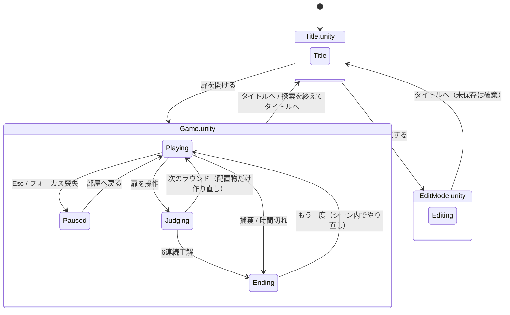

# 666号扉 再構築版 — 現状実装まとめ

2026-09-14 時点。対象はブランチ `feat/first-person-editor` の `Rebuild/666Door` です（§10）。

## 0. 先に結論

1. **シーンは「画面ごとの3シーン」＋「部屋の Field シーン」の4つ**です（§2）。画面を移るときはシーンを切り替え、部屋は各画面シーンが追加読込します。**部屋（建物・照明・扉・固定の家具）は `Field.unity` に実体として保存**されているので、再生しなくてもエディタで見て編集できます。
2. JSON の **`sceneId` は Unity のシーンではなく「部屋の配置パターン番号」**です。建物は全ステージで共通で、ステージごとに違うのは置かれる家具と異変だけです。
3. **編集画面は一人称です**。部屋を歩き回りながら配置物を置き、置いた異変はその場で動くので儀式を試せます（§7）。当初は見下ろし型の配置ツールとして作られていましたが、企画の意図に合わせて作り直しました。

---

## 1. フォルダ構成

```
Rebuild/666Door/                  独立した Unity プロジェクト（Unity 6000.3.10f1 / URP）
├─ Assets/
│  ├─ Game/Core/                  Unity に依存しないロジック（テスト対象）
│  │   StageData / StageRepository   ステージJSONの型、読込・マージ・保存
│  │   StageValidator                保存前の検証
│  │   RoundSelector / RunSession    部屋の抽選、ラン状態（連続正解・残り時間・終了種別）
│  │   AnomalyDefinition             異変定義（儀式・演出・手がかり・追跡設定）
│  │   RitualRuntime / ThreatRuntime 儀式の状態機械、追跡と捕獲の猶予
│  ├─ Game/Runtime/               MonoBehaviour 側
│  │   SceneController               画面シーン共通の土台（設定・入力・プレイヤー・UI・Field の読込・シーン移動）
│  │   TitleSceneController          Title.unity：背景の部屋とタイトルメニュー
│  │   GameSceneController           Game.unity：ラン、ラウンド進行、扉の判定、エンディング
│  │   EditModeSceneController       EditMode.unity：配置編集
│  │   FieldRoot                     Field.unity のルート。扉・配置物の親・ナビメッシュ・天井などへの参照
│  │   WorldBuilder                  Field の「Stage placements」の下にステージ配置物を生成
│  │   ObjectCatalog                 prefabId → 見た目（プリミティブの組み合わせ）と当たり判定
│  │   AnomalyActor / AnomalyEffects 異変1体分の儀式判定・認識演出・手がかり
│  │   FirstPersonRig / PlayerInputReader  一人称移動と入力（Input System）
│  │   GameUI / UI/                  Interface.prefab のルート。画面の切り替えとボタンの配線（uGUI + TextMeshPro、§6.1）
│  │   PlacementEditor               編集画面
│  │   SpatialAudio / SoundLibrary   効果音の3D再生。割り当てた音声ファイルか、コードで作った音（§6.2）
│  ├─ Game/Editor/                 ProjectBootstrap（初期化メニュー）、FieldSceneBuilder（Field.unity をコードから生成）、
│  │                                 FieldSceneAutoOpen（画面シーンを開くと Field も自動で追加表示）
│  ├─ Field/                        Field.unity 用のマテリアルとテクスチャ
│  ├─ Prefabs/                      Player.prefab（プレイヤーとカメラ）、UI/（画面ごとの UI、§6.1）
│  ├─ Resources/                    AnomalyDefinitions.json（異変定義）、DefaultAnomalies.json（初期ステージ）、SoundLibrary.asset（音の割り当て）、
│  │                                 GameSettings.asset（調整値）、PlayerControls.inputactions、フォント、
│  │                                 Materials/Catalog（配置物のマテリアル）
│  ├─ Scenes/                       Title / Game / EditMode / Field（初回だけ ProjectBootstrap が生成）
│  └─ Tests/Editor/                 EditMode テスト
└─ Documentation/                  このファイル、フォントライセンス
```

旧プロジェクト（リポジトリ直下の `Assets/`）のコードやシーンは使っていません。持ち込んだのは `DefaultAnomalies.json`、`bears.fbx`、日本語フォントだけです。

---

## 2. シーン管理

### 2.1 旧実装との比較

| | 旧実装 | 再構築版（シーン分割前） | 再構築版（現在） |
|---|---|---|---|
| Unity シーン | `tittle` / `MainScene` / `EditMode` / `endTitle` / `SampleScene` の5つ | `666Door` の1つ | `Title` / `Game` / `EditMode` ＋ `Field` |
| 画面の切り替え | `SceneManager.LoadScene` | 同じシーン内で UI とワールドを作り直す | `SceneManager.LoadScene`（Single） |
| 部屋 | シーンに手で配置 | すべてコードで生成 | `Field.unity` に実体として保存し、各画面シーンが追加読込 |
| ラウンドの交代 | ― | 部屋ごと作り直す | `Field` の `Stage placements` の下だけ作り直す |
| ラン状態 | `static` 変数でシーンをまたぐ | `SessionCoordinator` が保持 | `GameSceneController` が保持。シーンをまたいで持ち回らない |

「ラウンドごとにシーンを再ロードしない」「ラン状態を `static` で持ち回らない」（再構築仕様書 §8）は守っています。シーンを移ると、設定・ステージ・入力はそのシーンで読み直します。

| シーン | 置いてあるもの | 再生時にコードで作るもの |
|---|---|---|
| `Title.unity` | `TitleSceneController`、プレイヤー（`Player.prefab`。置いた位置と向きがタイトル背景の構図になる）、UI（`Interface.prefab`） | 環境音。背景として「ステージ1・異変なし」の配置物 |
| `Game.unity` | `GameSceneController`、プレイヤー、UI | 環境音、各ラウンドの配置物と異変（プレイヤーは毎ラウンドスタート地点へ移動） |
| `EditMode.unity` | `EditModeSceneController`、プレイヤー、UI | 環境音、編集中の配置物とガイド |
| `Field.unity` | 建物、照明8灯、前後の扉、固定の家具、掲示板など、`FieldRoot`、`NavMeshSurface` | なし（ナビメッシュのデータだけ、ラウンドごとに生成） |

### 2.2 画面遷移

画面の中の状態は各コントローラーの `Screen`（`GameScreen` 列挙型）で管理しています。設定画面は独立した画面ではなく、タイトルまたは一時停止の上に重ねるメニューです。



`Error` という状態もあります。保存ファイルを読めないとき、抽選できる部屋がないとき、Field シーンを読み込めないときに使います。

### 2.3 起動の流れ（画面シーン共通）

1. `Awake`：設定、異変定義、入力、プレイヤーと UI の初期化、ステージ（保存ファイル）、環境音を用意します（`SceneController`）。
2. `Start`：`Field` シーンが読み込まれていなければ追加読込し、`FieldRoot` を見つけて `WorldBuilder` を作ります。
3. `Enter`：シーンごとの処理に入ります。Title はタイトルメニュー、Game はランの開始、EditMode は編集画面を開きます。
4. 画面を移るときは `LoadScene`（Single）を呼びます。Field もいったん破棄され、次のシーンが読み直します。

### 2.4 エディタでの見え方と編集

- `Title` / `Game` / `EditMode` のどれかを開くと、`Field` も自動で追加表示されます（`FieldSceneAutoOpen`）。**再生しなくても部屋が見えます**。
- **建物・照明・扉・固定の家具は `Field.unity` を直接編集**します。変更は全画面に反映されます。
- ステージごとの配置物（JSON）は再生中にしか出てきません。編集は、ゲーム内の「部屋を編集する」で行います。
- **カメラと当たり判定は `Assets/Prefabs/Player.prefab`** にあります（FOV 72、描画距離 0.05〜70、背景色、URP のカメラ設定、身長 1.75m など）。叩くときに出す手（`Eyes/Hand`、`FirstPersonHand`）もここにあります（§6.3）。全シーン共通で変えるならプレハブ、シーンごとに変えるならシーン上のインスタンスで上書きします。各コントローラーの `Player` 欄にシーン上のプレイヤーを割り当てています。
- マテリアルは `Assets/Field/Materials`（部屋用）と `Assets/Resources/Materials/Catalog`（家具・異変用）にアセットとして置いてあります。
- 壁などのテクスチャの密度は `SurfaceTiling` コンポーネントの `Tiling` で変えられます。
- コードから部屋を作り直すメニュー **666号扉 → 部屋シーンを作り直す（上書き）** もありますが、手作業の変更は失われます。

### 2.5 部屋（Field.unity）の中身

1. 建物：14m×19m の区画、左右の袋小路、柱、天井、配管、蛍光灯8灯（うち1灯は `FieldRoot` がときどき明滅させる）
2. 扉：前の扉（z = 11.75、前進）と後ろの扉（z = −6.75、後退）
3. 固定の家具：椅子3つ、段ボール2つ、人形1体、熊1体、掲示板など。**全ステージ共通で、いつも同じ位置にあります**
4. `Stage placements`：空の親オブジェクト。ラウンドごとに JSON の `items` を置きます。異変は上限（3個）まで、追跡型は1体までです
5. `NavMeshSurface`：配置物を置いたあとに、ラウンドごとにナビメッシュを生成します（追跡型の経路探索用）

プレイヤーは毎ラウンド、スタート地点（0, 0.05, −4.8）へ戻されます。

> 注意：固定の家具（人形・熊・椅子・箱）と異変は、同じ見た目のモデルを使っています。

---

## 3. ゲームの流れ（実装）

1. `StartRun`：`RunSession` を作り、連続正解数を0にします。
2. `BuildNextRound`：乱数が 0.666 未満なら「異変あり」を希望し、`RoundSelector` が部屋を選びます（再構築仕様書 §3.2 の規則どおり。直前と同じ部屋は除外）。
3. `LoadRound`：部屋を作り、配置された異変ごとに `AnomalyActor` を付けます。**正解は「実際に置いた異変の数が1以上か」**で決まります。
4. 毎フレーム（`Update`）：
   - 移動と視点の処理
   - 視線レイを1本飛ばし、注視対象と扉を判定
   - 扉の前で E を押すと判定
   - 各異変の儀式を進める（注視、目を離す、近づく、離れる、静止、叩く など）
5. `ChooseDoor`：判定中は入力をロックし、フェードと「扉の先へ / ここへ、戻された。」を表示します。6連続正解ならエンディング、そうでなければ次のラウンドへ進みます。
6. 捕獲されるか、残り時間が0になると、その場でエンディング画面になります。

### 調整値（`Resources/GameSettings.asset`）

| 項目 | 値 |
|---|---|
| クリアに必要な連続正解 | 6 |
| 異変ラウンドの確率 | 0.666 |
| 1ラウンドの異変上限 | 6（編集画面で置ける上限と共通） |
| 配置の重なりの上限 | 75%（これを超えて埋まる配置物は置けない） |
| 重なりの大きい異変とみなす割合 | 25% |
| 重なりの小さい異変として先に必要な数 | 3 |
| 制限時間 | 180秒（ラウンドごとにリセット） |
| 歩行速度 | 4 m/s |
| 扉・注視の最大距離 | 4 m |
| 判定演出の時間 | 1.6 秒 |

---

## 4. ステージデータ

| 項目 | 内容 |
|---|---|
| 形式 | 旧JSONと完全互換（`scenes[].sceneId / anomalyHouse / items[].prefabId / position / rotation / isAnomaly`） |
| 初期データ | `Resources/DefaultAnomalies.json`（9ステージ。旧プロジェクトのものを無変更で同梱） |
| 保存先 | `%USERPROFILE%/AppData/LocalLow/Door666/666号扉/Saves/anomalies.json` |
| 初回起動 | 保存ファイルがなければ初期データをコピー |
| 読込・保存の規則 | 同じ `sceneId` は読込時にマージし、保存時は置き換える。未知の `prefabId` は警告を出してデータを保持（再構築仕様書 §5） |

初期9ステージは、どれも配置物が2〜3個だけの小さなものです（`*` が異変）。

| sceneId | 配置物 |
|---|---|
| 1 | 椅子、人形 |
| 2 | 椅子、熊* |
| 3 | 人形、椅子 |
| 4 | 人形、目を離した箱* |
| 5 | 椅子、痩せる箱*、人形* |
| 6 | 椅子、人形 |
| 7 | 椅子*、人形 |
| 8 | 呼吸する壁*、椅子 |
| 9 | 一歩多い足音*、椅子 |

---

## 5. 異変

定義は `Resources/AnomalyDefinitions.json` のデータで、儀式は共通の状態機械（`RitualRuntime`）で動かしています。`prefabId` ごとの `switch` 文はありません。

| ID | prefabId | 名前 | 儀式（概要） | 危険度 |
|---|---|---|---|---|
| ANM-001 | changeColorBox | 目を離した箱 | 1.5秒注視 → 1秒目を離す | 0 |
| ANM-002 | anomaryShirinkBox | 痩せる箱 | 2.5m以内に近づく | 0 |
| ANM-003 | DollPrefab | 帰ってくる人形 | 近づく → 6秒以内に4.5m以上離れる | 1 |
| ANM-004 | bears | 叩き起こし | 叩く → **追跡してくる** | 2 |
| ANM-005 | ChairPrefab | 席を数える椅子 | 境界を越える → 4秒以内に1秒注視 | 0 |
| ANM-006 | wall | 呼吸する壁 | 近づく → 目を離して2.5秒静止 | 1 |
| ANM-008 | footstepEcho | 一歩多い足音 | 余分な足音 → 0.8秒以内に静止 → 2秒静止 → 振り返る | 1 |

- **異変設計書の12種のうち、実装は7種**です。未実装は ANM-007 逆拍子時計、009 退く監視者、010 泣くロッカー、011 鏡の遅刻、012 六番目の影です。
- 手がかり（周期的な音と字幕）と、認識時の演出（赤く光る、縮む、消えて戻る、影が増える など）があります。
- 捕獲されたときの `endingId` はデータとしては持っていますが、エンディング画面は共通の文言で、異変ごとの専用エンディングはありません。

---

## 6. 入力・UI・音

- **入力**：Input System のみ（`PlayerControls.inputactions`）。キーボード・マウスとゲームパッドに対応。キーの割り当てと感度は設定画面で変えられ、PlayerPrefs に保存されます。
- **UI**：プレハブです（§6.1）。基準解像度は 1600×900（`CanvasScaler`、幅と高さの中間で合わせる）です。
- **音**：効果音と環境音は、`Resources/SoundLibrary.asset` に音声ファイルを割り当てればそれを鳴らし、空ならコードで作った波形を鳴らします（§6.2）。

### 6.1 UI の編集

`Assets/Prefabs/UI/` に画面ごとのプレハブがあり、`Interface.prefab`（Canvas と `GameUI`）がそれらを子として持っています。`Interface.prefab` は3つの画面シーンに置いてあり、各コントローラーの `UI` 欄に割り当てています。

| プレハブ | 画面 | 付いているコンポーネント |
|---|---|---|
| `HUD` | 歩いているときの表示（連続正解・残り時間・照準・照準の下の一行・バナー・音の字幕）。編集画面でも使う | `PlayHud` |
| `EditorHud` | 編集画面で歩いているときの表示（ステージ番号・置くもの・異変の数・メッセージ・操作説明） | `EditorHud` |
| `Title` / `Pause` | タイトル、一時停止 | `TitleScreen` / `PauseScreen` |
| `Settings` | 設定（感度・音の字幕・キー設定） | `SettingsScreen`、キー設定のボタンに `KeyBindingButton` |
| `Ending` / `Error` | エンディング、読込エラー | `EndingScreen` / `ErrorScreen` |
| `EditorMenu` | 編集画面の Tab メニュー | `EditorMenu` |

- **見た目**（位置・大きさ・色・フォント・文字の大きさ）は、プレハブを開いて直接変えます。全シーンに反映されます。
- **固定の文言**（見出し・ボタン名・操作説明）は、その文字の Text を書き換えます。
- **状況で変わる文言**（エンディングの文章、「扉の先へ。」などのバナー、扉の前の表示、連続正解の表示、字幕の書式、編集画面の見出しなど）は、各画面のルートのコンポーネント（`PlayHud`、`EndingScreen` など）のインスペクタで変えます。`{0}` などには数や名前が入ります（それぞれのツールチップに説明があります）。
- **ボタンの動作**は、ボタンに付いている `UIActionButton` の「Action」で選びます。ボタンを複製して別の動作を選べば、ボタンを増やせます（例：一時停止に「終了」を足す）。
- **キー設定のボタン**は `KeyBindingButton` で、名前・操作・何番目の割り当てかを持っています。
- 編集メニューの「置くもの」のボタンは、`Item template` を配置物の数だけ複製して並べます。並び方は `Catalog` の `Grid Layout Group` で変えます（列の数は Constraint Count。ボタンの幅は `EditorMenu` の「Fit Columns To Width」がオンなら並べる場所の幅に合わせ、オフなら Cell Size のままです）。
- 各シーンでは、そのシーンで最初に出る画面だけをオンにしてあります（Title は `Title`、Game は `HUD`、EditMode は `HUD` と `EditorHud`）。再生しなくても Game ビューに重なって見えます。ほかの画面は、シーンの `Interface` の下でオンにすれば見られます。
- シーン上の `Interface` で直した変更は、そのシーンだけの上書きになります。全シーンに反映したいときは、プレハブを開いて直すか、インスペクタの Overrides → Apply All でプレハブへ反映してください。
- 表示と非表示は実行時にコードが切り替えるので、確認のために画面をオンにしたまま保存しても動作には影響しません。プレハブに書いてある仮の文字（「03:00」など）も、実行時に置き換わります。
- 画面ごとのプレハブを消すと、起動時に「Interface に画面「…」がありません」というエラーになります。
- 編集画面の操作の結果を知らせるメッセージ（「ステージ 1 を読み込みました。」など）と、照準の下の配置の情報は、まだ `PlacementEditor` のコードに書いてあります。
- `ProjectBootstrap.Setup` は、足りないプレハブだけを作ります。作り直したいときは、`Assets/Prefabs/UI` をまとめて消してから、シーンの `Interface` も消して実行してください。

### 6.2 音の差し替え

`Assets/Resources/SoundLibrary.asset` を選ぶと、環境音と効果音の一覧が出ます。

- 「Clip」に音声ファイルを入れると、その音に置き換わります。空のものは、これまでどおりコードで作った音です。
- 「Volume」は音量の倍率です（元の音量はコードと異変定義で決まっています）。
- 「Key」はコードと `AnomalyDefinitions.json` の `sound` が使う名前なので、変えないでください。どこで鳴るかは「Usage」に書いてあります。

### 6.3 叩く動き

叩く（左クリック）と、画面の右下から拳が照準へ突き出て、画面の下へ引っ込みます。手が出るのは叩いている間（約0.4秒）だけです。

- 照準の先の届く範囲（4m）に物があると、拳はその表面の手前で止まり、叩く音（`knock`）が鳴って視点が少し跳ね上がります。何もなければ空振りです。
- 叩かれた物は動きません（通常版の「何度叩いても動かない」と区別がつかなくならないように）。
- 儀式が「叩いた」と受け取るのは、これまでどおりボタンを押した瞬間です。手の動きは見た目と音だけです。
- 手は `Player.prefab` の `Eyes/Hand` です。`FirstPersonHand` のインスペクタで、隠れているとき・叩いたときの位置と角度、各段階の時間、視点の跳ね上がり、音量を変えられます。見た目（`Model` の下の拳・親指・前腕・袖）は、`Model` をオンにすると確かめられます（再生時にはコードがオフにします）。マテリアルは `Assets/Prefabs/Materials` です。
- 手がないと、起動時に警告が出ます。`ProjectBootstrap.Setup` は手がないときだけ追加します。

---

## 7. 編集画面（EditMode）

「実装済み異変の性質と儀式について経験的に学べる空間」（`Docs/ゲーム概要_現在の認識.md`）、「各儀式が少なくとも一度成立する」ことの通し検証（`Docs/異変設計書.md` §10.2）という企画の意図に沿って、一人称で作っています。

### 7.1 現在の実装（`EditModeSceneController` ＋ `PlacementEditor`）

- タイトルの「部屋を編集する」で `EditMode.unity` に移り、スタート地点から一人称で歩けます（ゲーム本編と同じ移動・視点・叩く）。
- **置いた異変は置いた瞬間から動きます**。儀式の判定はゲーム本編と共通の `AnomalyActorSet` を使っています。
- **追跡型に捕まった場合**は、捕まえた異変だけを元の位置・未認識の状態に作り直し、編集はそのまま続きます。
- 配置物は1つ置くたびにその分だけ追加し、ナビメッシュを作り直します。ほかの異変の儀式の進み具合はリセットされません。

| 操作 | キーボード／マウス |
|---|---|
| メニューを開く／閉じる | Tab または Esc |
| 置く | Shift を押している間、視線の先の床にプレビューを表示（位置は1cm単位、Ctrl で0.25m刻み。枠の色は緑＝重なり小、黄＝重なり大だが置ける、赤＝置けない）→ 左クリック |
| 置く向きを変える | Shift＋ホイールで5°ずつ（Ctrl で45°ずつ）、Shift＋R で45° |
| 回転／削除 | 置いたものを見る（水色の枠。照準の下に名前・重なり率・向き）→ ホイール・R ／ Delete |
| 叩く（儀式） | 左クリック（Shift を押していないとき） |
| 保存 | F5（歩行中は現在のステージ番号、メニューでは入力した番号） |

- **メニュー**：置くものの一覧（通常／異変の切り替え付き）、ステージ番号の入力と読込・新規・保存、タイトルへ。メニューを開いている間は異変が止まり、カーソルが出ます。ウィンドウのフォーカスを失ったときもメニューが開きます。
- **重なり**：壁・家具・ほかの配置物とは重ねて置けます。重なり率は、配置物の当たり判定の箱を 5×5×5 点で調べ、ほかの物の中に入っている点の割合で測ります（床・自分・その配置物自身は数えません）。
  - 75% を超えて埋まる配置物は置けません（通常オブジェクトも同じ）。
  - 異変は6個まで。**重なりが25%を超える異変は、「異変の数 − 3」個まで**しか置けません。3個までは重なりの小さい異変であることが必要で、それを超える分は大きく重なっていてもかまいません。
  - HUD とメニューに「異変 n / 6　重なりの大きい異変 n / 枠」を表示します。
- **置けない場所**：床の範囲外、扉と重なる場所、自分と重なる場所。保存時には再構築仕様書 §6 の検証（異変の上限、追跡型は1体まで、初期位置の保護、扉との重なり など）に加えて、上の重なりの規則を検証します（削除や回転で規則を満たさなくなった場合に保存で気づけます）。
- **見えない配置物**：「一歩多い足音」には床に小さな円を表示し、見て選べるようにしています。
- **編集中はラウンドの制限をかけません**。異変が上限を超えていても、追跡型が複数あっても、置いたとおりに表示します（保存時にエラーになります）。

### 7.2 経緯

当初の実装（Codex）は、`Docs/再構築仕様書.md` §6 の機能一覧（配置・回転・削除・ステージ選択・保存・検証）だけを満たす見下ろし型の配置ツールで、編集中は異変が動きませんでした。「歩き回る」「儀式を試す」という意図は企画書と旧コードにしかなかったためです。旧実装（`Assets/Scripts/GameSystem/EditModeManager.cs`）の「Shift を押している間だけ視線の先にプレビューを出す」置き方を引き継いで、一人称に作り直しました。

### 7.3 未対応

- 編集画面のゲームパッド操作（置く・回転・削除・メニュー）
- 未対応の `prefabId` の配置物は表示しません（保存データには残ります）
- 置いた異変1つだけの儀式をリセットする操作（今は再読込するか、捕獲時に作り直されるのみ）

---

## 8. テストとビルド

| 種類 | 内容 |
|---|---|
| EditMode テスト | JSON互換、抽選、ラン状態、儀式、追跡、保存前検証、実行時の統合（Title → Game（探索・脱出・時間切れ・捕獲）→ EditMode → Title のシーン移動を含む）、編集中のマテリアル欠落検査。全84件 |
| 統合テストのスクリーンショット | `Artifacts/Screenshots/01〜04`（git 管理外） |
| 初期化 | メニュー **666号扉 → プロジェクトを初期化**（`ProjectBootstrap.Setup`） |
| ビルド | メニュー **666号扉 → Windows ビルド** → `Builds/Windows/666Door.exe`（git 管理外） |

コマンドラインで実行する例（プロジェクトを Unity エディタで開いていないときだけ実行できます）：

```powershell
& "C:\Program Files\Unity\Hub\Editor\6000.3.10f1\Editor\Unity.exe" -batchmode -quit -projectPath . -executeMethod Door666.Editor.ProjectBootstrap.Setup -logFile Artifacts/bootstrap.log
& "C:\Program Files\Unity\Hub\Editor\6000.3.10f1\Editor\Unity.exe" -batchmode -projectPath . -runTests -testPlatform EditMode -testResults Artifacts/test-results.xml -logFile Artifacts/test.log
```

### 8.1 ログで動作を確かめる

ゲームのログは、すべて `[666Door][分類]` で始まります（`Runtime/GameLog.cs`）。

- **Console** の検索欄に `[666Door]` と入れると、ゲームの流れだけが見えます。
- **ファイル**でも同じ文字で絞り込めます。エディタは `%LOCALAPPDATA%\Unity\Editor\Editor.log`、ビルドは `%USERPROFILE%\AppData\LocalLow\Door666\666号扉\Player.log` です。
  `Select-String -Path "$env:LOCALAPPDATA\Unity\Editor\Editor.log" -Pattern '\[666Door\]'`
- 通常の進行はスタックトレースなしの1行、警告とエラーはスタックトレース付きです。

**正常かどうかの目安**：各画面シーンの起動の最後に、次の1行が出ます。

```
[666Door][起動] Game の起動完了（画面: Playing）: 警告・エラーなし
```

起動中（シーンを開いてから最初の画面に入るまで）に警告やエラーが出ていると、この行が黄色の警告になり、件数が入ります。その上のログに原因があります。

| 分類 | 出るもの |
|---|---|
| 起動 | シーンの起動（異変定義・ステージの数、保存先、音の割り当て）、起動完了のまとめ、設定・Field・異変定義の不備 |
| 画面 | 画面の切り替え（`Playing → Paused` など）、シーン移動、エラー画面（エラーとして出る）、フォーカスが外れたことによる一時停止 |
| ラウンド | ランの開始と終了、抽選の結果、各ラウンドの配置と正解の扉、選んだ扉と判定・連続正解 |
| 部屋 | ルールで外した配置物（異変の上限、2体目の追跡型、未対応の配置物）、ナビメッシュの作成失敗 |
| 異変 | 儀式の成立（認識）、追跡の開始、捕獲、定義のない異変、追跡できない状態 |
| 編集 | ステージの読込・新規・保存（保存できないときは検証エラーを全件）、置く・削除、捕まった異変の作り直し |
| 入力 / 音 / 初期化 | キー設定の変更、叩いた対象（詳細ログ）、`KnownSounds` にない音の名前、`ProjectBootstrap` のメニュー |

統合テストを実行したときのログから抜き出した例です（テストは扉をすぐ選ぶので、残り時間がほぼ減っていません）。

```
[666Door][起動] Game を起動: 異変定義 7 種、ステージ 9 件、保存先 …\Saves\anomalies.json、効果音の割り当て 0/12（残りはコードの音）、環境音 コードの音
[666Door][ラウンド] ラン開始: 6 連続正解で脱出、各ラウンドの制限時間 180 秒
[666Door][ラウンド] 抽選 0.982 ≥ 0.666 → 異変なしを希望 → ステージ 8（異変なし）
[666Door][ラウンド] ラウンド 1 開始: ステージ 8、配置物 1 個、異変なし（異変なしの回なので、ステージの異変 1 個は置いていません） → 正解は前の扉
[666Door][画面] Playing
[666Door][起動] Game の起動完了（画面: Playing）: 警告・エラーなし
[666Door][ラウンド] 扉: 前を選択 → 正解（異変 0 個、認識 0 個）。連続正解 1/6、残り 180.0 秒
[666Door][画面] Playing → Judging
[666Door][ラウンド] 抽選 0.207 < 0.666 → 異変ありを希望 → ステージ 8（異変あり）
[666Door][ラウンド] ラウンド 3 開始: ステージ 8、配置物 2 個、異変 1 個（呼吸する壁） → 正解は後ろの扉
[666Door][ラウンド] 扉: 後ろを選択 → 正解（異変 1 個、認識 0 個）。連続正解 3/6、残り 179.9 秒
[666Door][異変] ANM-004 叩き起こし: 儀式が成立し、認識しました（出現から 0.1 秒）。追跡型です
[666Door][異変] ANM-004 叩き起こし: プレイヤーを捕まえました（認識から 1.2 秒）
[666Door][ラウンド] ラン終了: 捕獲（叩き起こし、エンディング doll_procession）。2 ラウンド目、連続正解 1/6
```

**詳細ログ**：`Resources/GameSettings.asset` の「ログ → Verbose Logging」をオンにすると、儀式の各段階も出ます。「儀式が成立しない」ときに、どの段階で止まっているかを確かめるのに使います。

```
[666Door][異変] ANM-006 呼吸する壁: 段階 1/2（EnterRadius 半径 3m）成立 → 次は RemainStill 2.5 秒
[666Door][異変] ANM-006 呼吸する壁: 段階 2/2（RemainStill 2.5 秒）が途切れ、段階 1（EnterRadius 半径 3m）からやり直し
```

ほかに、手がかりの音、ボタン操作、メニューの開閉、回転、置けなかった理由、配置のまとめ、ナビメッシュの作り直しも出ます。歩いている間に毎フレーム段階を行き来する儀式（呼吸する壁など）があるので、同じ段階の変化は2秒に1回までしか出しません。

---

## 9. 仕様との差分・既知の問題

| 区分 | 内容 |
|---|---|
| 設計のズレ | 編集画面が一人称ではない（§7） |
| 未実装 | 異変12種のうち5種。異変ごとの専用エンディング。異変個数の重み付き抽選（1個72% / 2個23% / 3個5%）と、連続正解数による難易度制御（README に「導入しない」と記載。企画側の判断が未決） |
| 未実装 | ネタバレ防止用の `.666stage` 形式（異変設計書 §10.2 で将来対応とされているもの） |
| 見た目 | 家具・異変の多くがプリミティブの組み合わせで、仮の見た目 |
| 固定の家具 | 全ステージで同じ位置に同じ家具がある。異変と同じモデルを使う |
| 未確認 | 編集画面で「紫のメッシュ」が出るという報告。自動テストと撮影では再現していない |
| 環境 | Unity の Console で **Error Pause** がオンだと、エラーが1件出るだけでプレイモードが止まる（検証中に確認） |
| ドキュメント | README が参照している `Documentation/実装・検証記録.md` はまだない |

---

## 10. コミット履歴

| ブランチ | コミット | 内容 |
|---|---|---|
| `feat/rebuild-666door` | `78d7503` | Codex が作業を中断した時点のスナップショット |
| 〃 | `49d514b` | バッチ実行で初期化が失敗する問題（TMP の基本リソース未取り込み）の修正と、生成アセットの追加 |
| 〃 | `b0c63cf` | 見下ろし型編集画面のカメラとレイアウトの修正、この資料の初版 |
| `feat/scene-split` | `f8f3247` | シーン分割（§2）：Title / Game / EditMode / Field への分割、部屋のシーン化、マテリアルのアセット化 |
| `feat/first-person-editor` | `1ca7a83` | 編集画面の一人称化（§7）、異変の駆動をゲーム本編と共通化 |
| 〃 | `6cd7ba1` | 重なりを許す配置ルール、位置・向きの細かい指定 |
| 〃 | （最新） | プレイヤーとカメラを `Player.prefab` として各画面シーンに配置、MCP 用に `com.unity.ai.assistant` を追加 |

見下ろし型編集画面のレイアウト修正（`b0c63cf`）は、§7 の一人称化で不要になる可能性があります。
