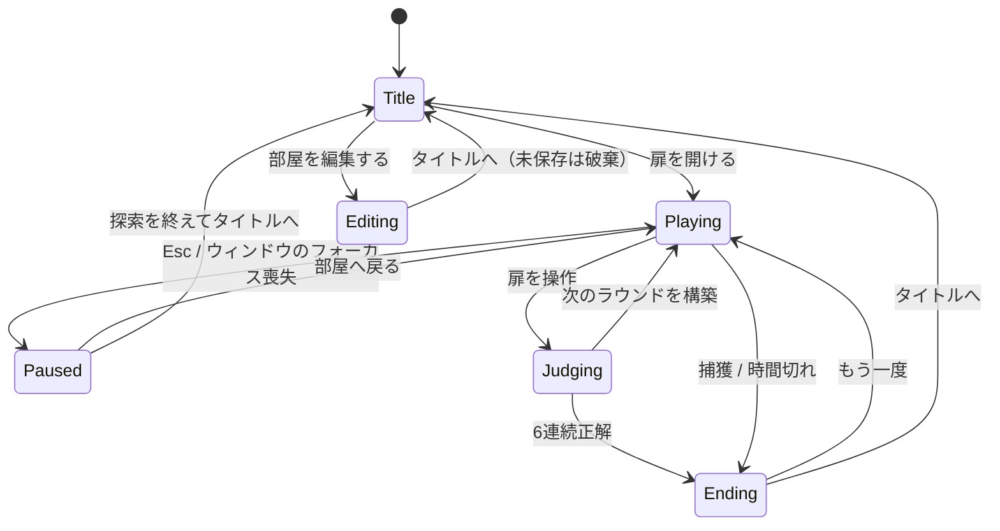

# 666号扉 再構築版 — 現状実装まとめ

2026-09-14 時点。対象はブランチ `feat/rebuild-666door` の `Rebuild/666Door`（コミット `49d514b`）と、その上の未コミット変更（§11）です。

## 0. 先に結論

1. **Unity のシーンは1つだけ**です（`Assets/Scenes/666Door.unity`）。タイトル・探索・一時停止・終了・編集は、すべて同じシーンの中での「画面」の切り替えです。部屋、プレイヤー、UI、照明は再生開始時にすべてコードで作られるので、**再生していないときにシーンを開いても、ほぼ何もありません**。
2. JSON の **`sceneId` は Unity のシーンではなく「部屋の配置パターン番号」**です。建物は全ステージで共通で、ステージごとに違うのは置かれる家具と異変だけです。
3. **編集画面は、企画の意図とズレた形で作られています**。企画と旧実装では「一人称で歩き回り、異変を置いて、その場で儀式を試せる空間」でした。再構築版は「真上から見下ろしてクリックで置く配置ツール」で、編集中に異変は動きません（§7）。

---

## 1. フォルダ構成

```
Rebuild/666Door/                  独立した Unity プロジェクト（Unity 6000.3.10f1 / URP）
├─ Assets/
│  ├─ Game/Core/                  Unity に依存しないロジック（テスト対象）
│  │   StageData / StageRepository   ステージJSONの型、読込・マージ・保存
│  │   StageValidator                保存前の検証
│  │   RoundSelector / RunSession    部屋の抽選、ラン状態（連続正解・残り時間・終了種別）
│  │   AnomalyDefinition             異変定義（儀式・演出・手がかり・追跡設定）
│  │   RitualRuntime / ThreatRuntime 儀式の状態機械、追跡と捕獲の猶予
│  ├─ Game/Runtime/               MonoBehaviour 側
│  │   SessionCoordinator            全体の司令塔。画面遷移とラウンド進行（シーン内の唯一の配置物）
│  │   WorldBuilder                  部屋の建物・固定家具・照明・扉・ステージ配置物を生成
│  │   ObjectCatalog                 prefabId → 見た目（プリミティブの組み合わせ）と当たり判定
│  │   AnomalyActor / AnomalyEffects 異変1体分の儀式判定・認識演出・手がかり
│  │   FirstPersonRig / PlayerInputReader  一人称移動と入力（Input System）
│  │   GameUI                        全画面のUIをコードで生成（uGUI + TextMeshPro）
│  │   PlacementEditor               編集画面
│  │   SpatialAudio                  効果音をコードで生成して3D再生
│  ├─ Game/Editor/ProjectBootstrap  シーン・URP・日本語フォント・熊プレハブを生成するメニュー処理
│  ├─ Resources/                    AnomalyDefinitions.json（異変定義）、DefaultAnomalies.json（初期ステージ）、
│  │                                 GameSettings.asset（調整値）、PlayerControls.inputactions、フォント、生成マテリアル
│  ├─ Scenes/666Door.unity          唯一のシーン（ProjectBootstrap が自動生成）
│  └─ Tests/Editor/                 EditMode テスト
└─ Documentation/                  このファイル、フォントライセンス
```

旧プロジェクト（リポジトリ直下の `Assets/`）のコードやシーンは使っていません。持ち込んだのは `DefaultAnomalies.json`、`bears.fbx`、日本語フォントだけです。

---

## 2. シーン管理

### 2.1 旧実装との比較

| | 旧実装 | 再構築版 |
|---|---|---|
| Unity シーン | `tittle` / `MainScene` / `EditMode` / `endTitle` / `SampleScene` の5つ | `666Door` の1つだけ |
| 画面の切り替え | `SceneManager.LoadScene` でシーンを移動 | 同じシーンの中で UI とワールドを作り直す |
| 部屋の中身 | シーンに手で置いたオブジェクト＋JSON | すべてコードで生成＋JSON |
| ラン状態の持ち回り | `static` 変数でシーンをまたぐ | `SessionCoordinator` が保持（シーン遷移がない） |

「ラウンドごとにシーンを再ロードしない」は再構築仕様書 §8 の推奨どおりです。

### 2.2 画面遷移

画面は `SessionCoordinator.Screen`（`GameScreen` 列挙型）で管理しています。設定画面は独立した画面ではなく、タイトルまたは一時停止の上に重ねるメニューです。



`Error` という状態もあります。保存ファイルを読めないときや、抽選できる部屋がないときに使います。

### 2.3 シーンを開いても何もない理由

- `666Door.unity` に入っているのは `SessionCoordinator` を付けた GameObject 1つだけです。
- 再生を始めると `Awake` で次のものを作ります：プレイヤー（カメラ付き）、UI、`WorldBuilder`、`PlacementEditor`、ステージの読込、環境音。そのあとタイトル画面を表示します。
- プレハブはほぼ使っていません。家具も壁も、Cube や Sphere などのプリミティブをコードで組み合わせています。例外は熊だけで、`bears.fbx` から作ったプレハブを使います。
- そのため、**再生していないとシーンビューもヒエラルキーも空です**。再生中にヒエラルキーで見たり触ったりしたものは、停止すると消えます。見た目や配置の調整は、コード（`WorldBuilder` / `ObjectCatalog`）か JSON でしか行えません。

### 2.4 ラウンドごとの部屋の作り直し

`WorldBuilder.Build()` は、前の部屋のルート（`Round world N`）を破棄してから、次の順番で作り直します。

1. 建物：14m×19m の区画、左右の袋小路、柱、天井、配管、蛍光灯8灯
2. 扉：前の扉（z = 11.75、前進）と後ろの扉（z = −6.75、後退）
3. 固定の家具：椅子3つ、段ボール2つ、人形1体、熊1体、掲示板など。**全ステージ共通で、いつも同じ位置にあります**
4. ステージの配置物：JSON の `items`。異変は上限（3個）まで、追跡型は1体まで置きます
5. ナビメッシュの生成（追跡型が経路探索に使います）

プレイヤーは毎ラウンド、スタート地点（0, 0.05, −4.8）へ戻されます。タイトル画面の背景は「ステージ1を異変なしで作った部屋」です。

> 注意：固定の家具（人形・熊・椅子・箱）と異変は、同じ見た目のモデルを使っています。

---

## 3. ゲームの流れ（実装）

1. `StartRun`：`RunSession` を作り、連続正解数を0にします。
2. `BuildNextRound`：乱数が 0.666 未満なら「異変あり」を希望し、`RoundSelector` が部屋を選びます（再構築仕様書 §3.2 の規則どおり。直前と同じ部屋は除外）。
3. `LoadRound`：部屋を作り、配置された異変ごとに `AnomalyActor` を付けます。**正解は「実際に置いた異変の数が1以上か」**で決まります。
4. 毎フレーム（`Update`）：
   - 移動と視点の処理
   - 視線レイを1本飛ばし、注視対象と扉を判定
   - 扉の前で E を押すと判定
   - 各異変の儀式を進める（注視、目を離す、近づく、離れる、静止、叩く など）
5. `ChooseDoor`：判定中は入力をロックし、フェードと「扉の先へ / ここへ、戻された。」を表示します。6連続正解ならエンディング、そうでなければ次のラウンドへ進みます。
6. 捕獲されるか、残り時間が0になると、その場でエンディング画面になります。

### 調整値（`Resources/GameSettings.asset`）

| 項目 | 値 |
|---|---|
| クリアに必要な連続正解 | 6 |
| 異変ラウンドの確率 | 0.666 |
| 1ラウンドの異変上限 | 3 |
| 制限時間 | 180秒（ラウンドごとにリセット） |
| 歩行速度 | 4 m/s |
| 扉・注視の最大距離 | 4 m |
| 判定演出の時間 | 1.6 秒 |

---

## 4. ステージデータ

| 項目 | 内容 |
|---|---|
| 形式 | 旧JSONと完全互換（`scenes[].sceneId / anomalyHouse / items[].prefabId / position / rotation / isAnomaly`） |
| 初期データ | `Resources/DefaultAnomalies.json`（9ステージ。旧プロジェクトのものを無変更で同梱） |
| 保存先 | `%USERPROFILE%/AppData/LocalLow/Door666/666号扉/Saves/anomalies.json` |
| 初回起動 | 保存ファイルがなければ初期データをコピー |
| 読込・保存の規則 | 同じ `sceneId` は読込時にマージし、保存時は置き換える。未知の `prefabId` は警告を出してデータを保持（再構築仕様書 §5） |

初期9ステージは、どれも配置物が2〜3個だけの小さなものです（`*` が異変）。

| sceneId | 配置物 |
|---|---|
| 1 | 椅子、人形 |
| 2 | 椅子、熊* |
| 3 | 人形、椅子 |
| 4 | 人形、目を離した箱* |
| 5 | 椅子、痩せる箱*、人形* |
| 6 | 椅子、人形 |
| 7 | 椅子*、人形 |
| 8 | 呼吸する壁*、椅子 |
| 9 | 一歩多い足音*、椅子 |

---

## 5. 異変

定義は `Resources/AnomalyDefinitions.json` のデータで、儀式は共通の状態機械（`RitualRuntime`）で動かしています。`prefabId` ごとの `switch` 文はありません。

| ID | prefabId | 名前 | 儀式（概要） | 危険度 |
|---|---|---|---|---|
| ANM-001 | changeColorBox | 目を離した箱 | 1.5秒注視 → 1秒目を離す | 0 |
| ANM-002 | anomaryShirinkBox | 痩せる箱 | 2.5m以内に近づく | 0 |
| ANM-003 | DollPrefab | 帰ってくる人形 | 近づく → 6秒以内に4.5m以上離れる | 1 |
| ANM-004 | bears | 叩き起こし | 叩く → **追跡してくる** | 2 |
| ANM-005 | ChairPrefab | 席を数える椅子 | 境界を越える → 4秒以内に1秒注視 | 0 |
| ANM-006 | wall | 呼吸する壁 | 近づく → 目を離して2.5秒静止 | 1 |
| ANM-008 | footstepEcho | 一歩多い足音 | 余分な足音 → 0.8秒以内に静止 → 2秒静止 → 振り返る | 1 |

- **異変設計書の12種のうち、実装は7種**です。未実装は ANM-007 逆拍子時計、009 退く監視者、010 泣くロッカー、011 鏡の遅刻、012 六番目の影です。
- 手がかり（周期的な音と字幕）と、認識時の演出（赤く光る、縮む、消えて戻る、影が増える など）があります。
- 捕獲されたときの `endingId` はデータとしては持っていますが、エンディング画面は共通の文言で、異変ごとの専用エンディングはありません。

---

## 6. 入力・UI・音

- **入力**：Input System のみ（`PlayerControls.inputactions`）。キーボード・マウスとゲームパッドに対応。キーの割り当てと感度は設定画面で変えられ、PlayerPrefs に保存されます。
- **UI**：すべてコードで生成しています（`GameUI`）。画面比率に対する割合で配置し、基準解像度は 1600×900 です。
- **音**：効果音と環境音もコードで波形を作っています。音声ファイルはありません。

---

## 7. 編集画面（EditMode）— 企画とのズレ

### 7.1 現在の実装（`PlacementEditor`）

- タイトルの「部屋を編集する」で開く
- カメラを**真上からの平行投影**に切り替え、左に配置物の一覧、下にメッセージ欄を表示
- 一覧から名前を選ぶ → マウスで床をクリックして配置（0.25m単位で吸着）
- 置いたものをクリックで選択 → R で45°回転、Delete で削除、F5 で保存、右クリックで配置モードを解除
- ステージは番号を入力して「読込」、または「新規」
- **プレイヤーは動かせず、異変も動きません**（コードに「このビューでは異変の実行時処理を動かさない」と明記）

### 7.2 本来の意図との比較

| 観点 | 企画書・旧実装 | 再構築版 |
|---|---|---|
| 視点 | 一人称で部屋を歩き回る | 真上からの見下ろし、プレイヤーは停止 |
| 置き方 | 視線の先へビームを出し、Shift を押している間プレビュー、クリックで配置。ホイールで配置物を切り替え | マウスで床をクリック |
| 異変 | その場で見る・叩くなどの儀式を試せる（旧 `EditModeManager` がプレイヤーに `PlayerInteractionController` を付けていた） | 動かない |
| 目的 | 「実装済み異変の性質と儀式について経験的に学べる空間」（`Docs/ゲーム概要_現在の認識.md`）。公開前の通し検証「各儀式が少なくとも一度成立する」（`Docs/異変設計書.md` §10.2） | 配置データを編集するツール |
| ステージ選択 | ドロップダウン | 番号入力＋読込ボタン |

### 7.3 ズレた原因

実装者（Codex）が主に参照した `Docs/再構築仕様書.md` §6 EditMode には、「配置・回転・削除・ステージ選択・保存・検証」という**機能一覧しか書かれていません**。「歩き回る」「儀式を試す」という意図は、企画書（ゲーム概要）と旧コードにしかありませんでした。そのため、機能一覧を最短で満たす見下ろし型のツールとして作られています。

### 7.4 作り直す前に決めること

- 編集中は異変を常に動かすか、「配置モード」と「試しプレイモード」を切り替えるか
- 追跡型（熊）が編集中に襲ってきたとき、捕獲されたらどう扱うか（無効にする、位置をリセットする など）
- 置き方を旧実装と同じ視線ビームにするか（ゲームパッドでの操作も含めて）
- 置いた異変の儀式を、その場で再挑戦するためのリセット操作
- 配置物の一覧と保存 UI を、歩いているときにどう出すか（常時表示か、キーで開くか）

---

## 8. テストとビルド

| 種類 | 内容 |
|---|---|
| EditMode テスト | JSON互換、抽選、ラン状態、儀式、追跡、保存前検証、実行時の統合（タイトル → 探索 → 脱出 → 時間切れ → 捕獲 → 編集）。コミット済み78件はすべて成功 |
| 統合テストのスクリーンショット | `Artifacts/Screenshots/01〜04`（git 管理外） |
| 初期化 | メニュー **666号扉 → プロジェクトを初期化**（`ProjectBootstrap.Setup`） |
| ビルド | メニュー **666号扉 → Windows ビルド** → `Builds/Windows/666Door.exe`（git 管理外） |

コマンドラインで実行する例（プロジェクトを Unity エディタで開いていないときだけ実行できます）：

```powershell
& "C:\Program Files\Unity\Hub\Editor\6000.3.10f1\Editor\Unity.exe" -batchmode -quit -projectPath . -executeMethod Door666.Editor.ProjectBootstrap.Setup -logFile Artifacts/bootstrap.log
& "C:\Program Files\Unity\Hub\Editor\6000.3.10f1\Editor\Unity.exe" -batchmode -projectPath . -runTests -testPlatform EditMode -testResults Artifacts/test-results.xml -logFile Artifacts/test.log
```

---

## 9. 仕様との差分・既知の問題

| 区分 | 内容 |
|---|---|
| 設計のズレ | 編集画面が一人称ではない（§7） |
| 未実装 | 異変12種のうち5種。異変ごとの専用エンディング。異変個数の重み付き抽選（1個72% / 2個23% / 3個5%）と、連続正解数による難易度制御（README に「導入しない」と記載。企画側の判断が未決） |
| 未実装 | ネタバレ防止用の `.666stage` 形式（異変設計書 §10.2 で将来対応とされているもの） |
| 見た目 | 家具・異変の多くがプリミティブの組み合わせで、仮の見た目 |
| 固定の家具 | 全ステージで同じ位置に同じ家具がある。異変と同じモデルを使う |
| 未確認 | 編集画面で「紫のメッシュ」が出るという報告。自動テストと撮影では再現していない |
| 環境 | Unity の Console で **Error Pause** がオンだと、エラーが1件出るだけでプレイモードが止まる（検証中に確認） |
| ドキュメント | README が参照している `Documentation/実装・検証記録.md` はまだない |

---

## 10. コミット履歴（このブランチ）

| コミット | 内容 |
|---|---|
| `78d7503` | Codex が作業を中断した時点のスナップショット |
| `49d514b` | バッチ実行で初期化が失敗する問題（TMP の基本リソース未取り込み）の修正と、生成アセットの追加 |

## 11. 未コミットの変更

見下ろし型の編集画面を前提にした、レイアウトの修正です。§7 の作り直しをするなら、この変更は不要になる可能性があります。

- 編集カメラを全画面で描画し、パネルを除いた領域にマップが収まるよう配置（以前はカメラの描画範囲を画面の一部に絞っていたため、範囲外が消去されず残像が出ていた）
- 編集中だけ環境光を明るくする
- 下部のメッセージ欄に背景を付け、その下でのクリック配置を防ぐ
- ボタンの文字を折り返さずに自動縮小する
- `WorldBuilder` の廃止予定 API（`enableWordWrapping`）の置き換え
- テスト追加：`StageEditorRenderingTests`（編集中にマテリアルの欠落やエラーシェーダーがないかの検査）
